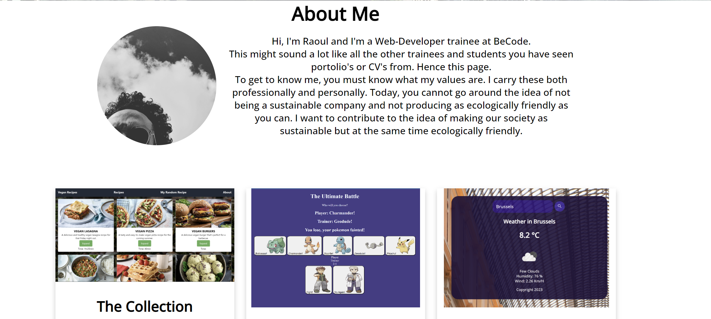

# Welcome to my Portfolio
> Live demo [_here_](https://raoul-portfolio.netlify.app/). <!-- If you have the project hosted somewhere, include the link here. -->

## Table of Contents
* [General Info](#general-information)
* [Technologies Used](#technologies-used)
* [Features](#features)
* [Screenshots](#screenshots)
* [Usage](#usage)
* [Room for Improvement](#room-for-improvement)
* [Acknowledgements](#acknowledgements)
* [Contact](#contact)
<!-- * [License](#license) -->

## General Information
- This is my Portfolio, through it I hope to give the visitor a better understanding of my skills and motivation as a webdeveloper.

## Technologies Used
- HTML
- CSS
- JavaScript

## Features
List the ready features here:
- Hamburger Menu on responsive navbar
- Scroll navigation when using the navbar

## Screenshots

<!-- If you have screenshots you'd like to share, include them here. -->

## Usage
Just go ahead and use the awesome navbar to go around.

## Room for Improvement

Room for improvement:
- Add nicer projects
- Learn CSS from scratch (again)

To do:
- Update current projects with remade ones.
- Add section about skills

## Acknowledgements
Give credit here.
- This project was inspired by BeCode.
- This project was based on projects done at BeCode
- Many thanks to Gidget
- For Hamburger-menu questions please see Mr. Mykola Marenich.

## Contact
Created by [Raoul Vandevelde](https://github.com/RalloField) - feel free to contact me!

<!-- Optional -->
<!-- ## License -->
<!-- This project is open source and available under the [... License](). -->

<!-- You don't have to include all sections - just the one's relevant to your project -->
